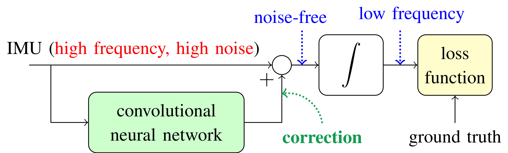
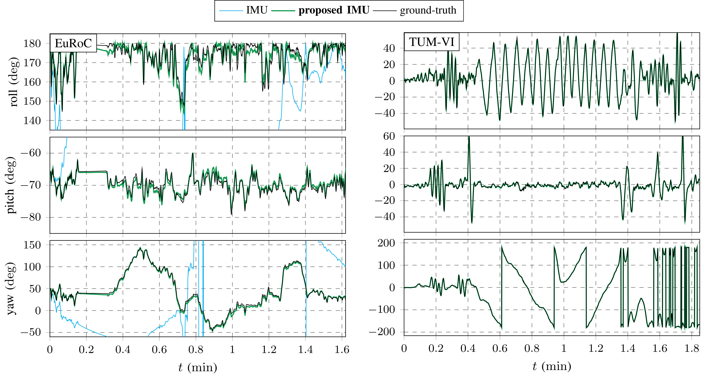
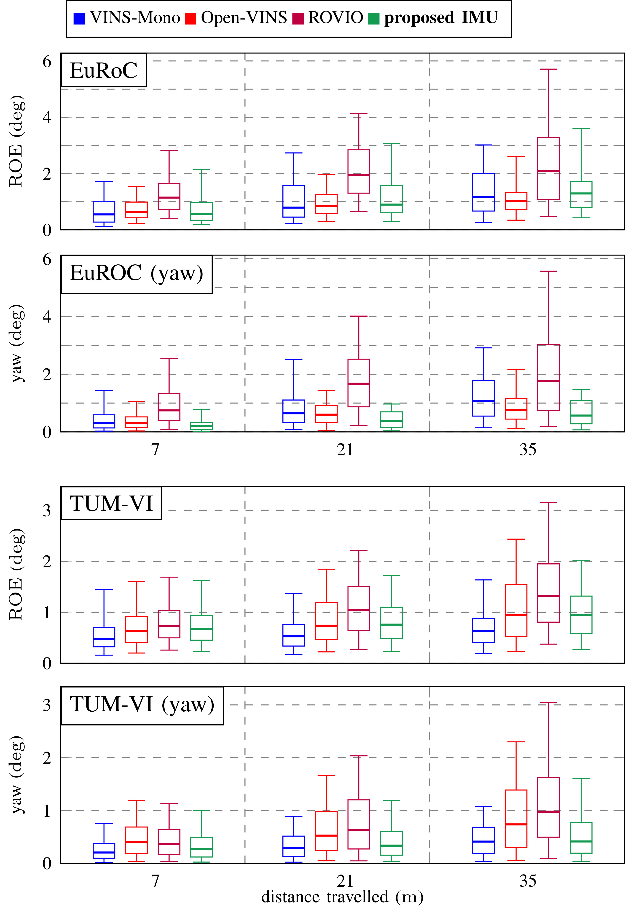

# Denoising IMU Gyro with Deep Learning for Open-Loop Orientation Estimation

## Overview [[paper]()]

This repo contains a learning method for denoising gyroscopes of Inertial Measurement Units (IMUs) using
ground truth data. In terms of attitude dead-reckoning estimation, the obtained algorithm is able to beat top-ranked
visual-inertial odometry systems [3-5] in terms of attitude estimation
although it only uses signals from a low-cost IMU. The obtained
performances are achieved thanks to a well chosen model, and a
proper loss function for orientation increments. Our approach builds upon a neural network based
on dilated convolutions, without requiring any recurrent neural
network.

## Code
Our implementation is based on Python 3 and [Pytorch](https://pytorch.org/). We
test the code under Ubuntu 16.04, Python 3.5, and Pytorch 1.5. The codebase is licensed under the MIT License.

### Installation & Prerequies
1.  Install the correct version of [Pytorch](http://pytorch.org)
```
pip install --pre torch  -f https://download.pytorch.org/whl/nightly/cu101/torch_nightly.html
```

2.  Clone this repo and create empty directories
```
git clone https://github.com/mbrossar/denoise-imu-gyro.git
mkdir denoise-imu-gyro/data
mkdir denoise-imu-gyro/results
```

3.  Install the following required Python packages, e.g. with the pip command
```
pip install -r denoise-imu-gyro/requirements.txt
```

### Testing

1. Download reformated pickle format of the _EuRoC_ [1] and _TUM-VI_ [2] datasets at this [url](https://cloud.mines-paristech.fr/index.php/s/MRXzSMDX829Qb6k/download), extract and copy then in the `data` folder.
```
wget "https://cloud.mines-paristech.fr/index.php/s/MRXzSMDX829Qb6k/download"
unzip download -d denoise-imu-gyro/data
rm download
```
These file can alternatively be generated after downloading the _EuRoC_ and
_TUM-VI_ datasets. They will be generated when lanching the main file after
providing data paths.

2. Download optimized parameters at this [url](https://cloud.mines-paristech.fr/index.php/s/AMe4V1KYvyHtvEC/download), extract and copy in the `results` folder.
```
wget "https://cloud.mines-paristech.fr/index.php/s/AMe4V1KYvyHtvEC/download"
unzip download -d denoise-imu-gyro/results
rm download
```
3. Test on the dataset on your choice !
```
cd denoise-imu-gyro
python3 main_EUROC.py
# or alternatively
# python3 main_TUMVI.py
```

You can then compare results with the evaluation [toolbox](https://github.com/rpng/open_vins/) of [3].

### Training
You can train the method by
uncomment the two lines after # train in the main files. Edit then the
configuration to obtain results with another sets of parameters. It roughly
takes 5 minutes per dataset with a decent GPU.

## Schematic Illustration of the Proposed Method

<p align="center">

</p>

The convolutional neural network
computes gyro corrections (based on past IMU measurements) that filters
undesirable errors in the raw IMU signals. We
then perform open-loop time integration on the noise-free measurements
for regressing low frequency errors between ground truth and estimated
orientation increments.

## Results

<p align="center">

</p>

Orientation estimates on the test sequence _MH 04 difficult_ of [1] (left), and
_room 4_ of [2] (right). Our method removes errors of the  IMU.

<p align="center">

</p>

Relative Orientation Error (ROE) in terms of 3D orientation and
yaw errors on the test sequences. Our method competes with VIO methods albeit based only on IMU signals.

## Paper
The paper _Denoising IMU Gyro with Deep Learning for Open-Loop Orientation
Estimation_, M. Brossard, S. Bonnabeln and A. Barrau. 2020, relative to this repo is
available at this [url]().


## Citation

If you use this code in your research, please cite:

```
@article{brossard2020denoising,
  author = {Martin Brossard and Silv\`ere Bonnabel and Axel Barrau},
  title = {{Denoising IMU Gyro with Deep Learning for Open-Loop Orientation Estimation}},
  year = {2020}
}
```

## Authors

This code was written by the [Centre of Robotique](http://caor-mines-paristech.fr/en/home/) at the
MINESParisTech, Paris, France.

[Martin
Brossard](mailto:martin.brossard@mines-paristech.fr)^, [Axel
Barrau](mailto:axel.barrau@safrangroup.com)^ and [Silvère
Bonnabel](mailto:silvere.bonnabel@mines-paristech.fr)^.

^[MINES ParisTech](http://www.mines-paristech.eu/), PSL Research University,
Centre for Robotics, 60 Boulevard Saint-Michel, 75006 Paris, France.

## Biblio

[1] M. Burri, J. Nikolic, P. Gohl, T. Schneider, J. Rehder, S. Omari,
M. W. Achtelik, and R. Siegwart, ``_The EuRoC Micro Aerial Vehicle
Datasets_", The International Journal of Robotics Research, vol. 35,
no. 10, pp. 1157–1163, 2016.

[2] D. Schubert, T. Goll, N. Demmel, V. Usenko, J. Stuckler, and
D. Cremers, ``_The TUM VI Benchmark for Evaluating Visual-Inertial
Odometry_", in International Conference on Intelligent Robots and
Systems (IROS). IEEE, pp. 1680–1687, 2018.

[3] P. Geneva, K. Eckenhoff, W. Lee, Y. Yang, and G. Huang, ``_OpenVINS:
A Research Platform for Visual-Inertial Estimation_", IROS Workshop
on Visual-Inertial Navigation: Challenges and Applications, 2019.

[4] T. Qin, P. Li, and S. Shen, ``_VINS-Mono: A Robust and Versatile
Monocular Visual-Inertial State Estimator_", IEEE Transactions on
Robotics, vol. 34, no. 4, pp. 1004–1020, 2018.

[5] M. Bloesch, M. Burri, S. Omari, M. Hutter, and R. Siegwart, ``_Iterated
Extended Kalman Filter Based Visual-Inertial Odometry Using Direct Photometric
Feedback_", The International Journal of Robotics Research,vol. 36, no. 10, pp.
1053ñ1072, 2017.